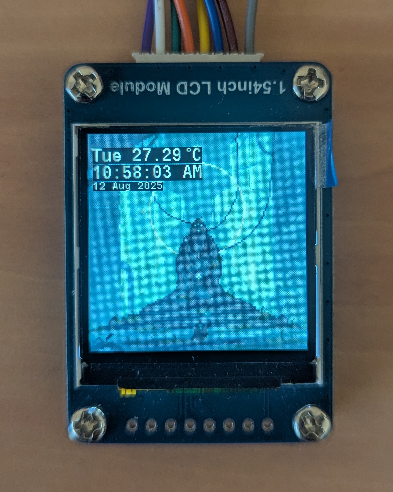

# ST7789 Digital Clock ⏰🌦

An embedded digital clock built with **STM32** and an **ST7789 LCD display**.  
Displays:
- Current time & date (generated at build time and then RTC)
- Weather temperature (via BME280 sensor using I2C)
- Background animations (Sending frame data through SPI)

This project was inspired by [The Wrench’s DIY Mini Desk Clock](https://www.youtube.com/watch?v=35zs2J3Prxo).  
After watching this I attempted to build my own on STM32 with a few twists, such as background animations and a weather sensor (since I don’t have a Wi-Fi module).

## 🛠 Hardware

- STM32 Nucleo board (in picture: **[FF446RE]**)
- ST7789 240x240 TFT LCD
- BME280 temperature & humidity sensor
- Logic analyzer (to debug SPI data)

---